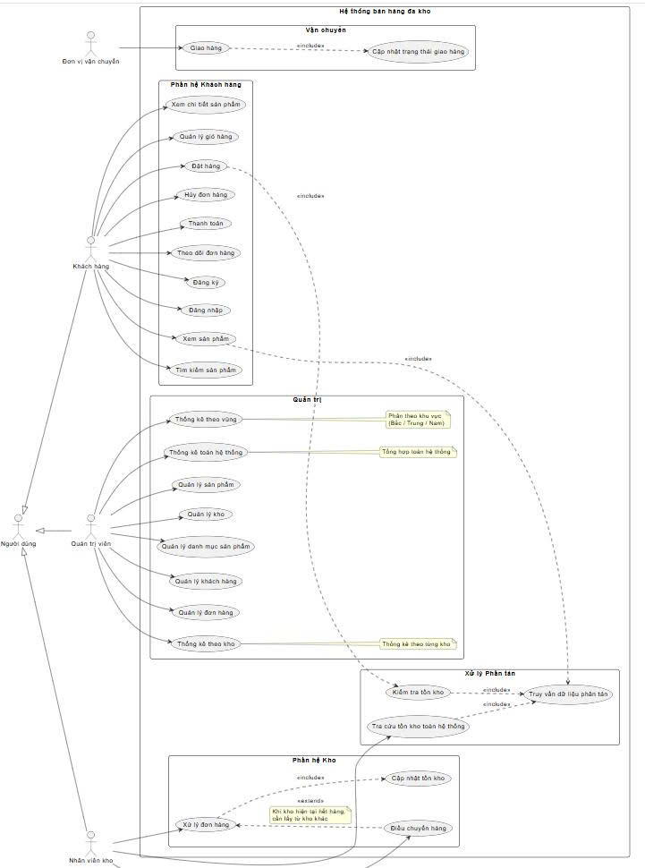
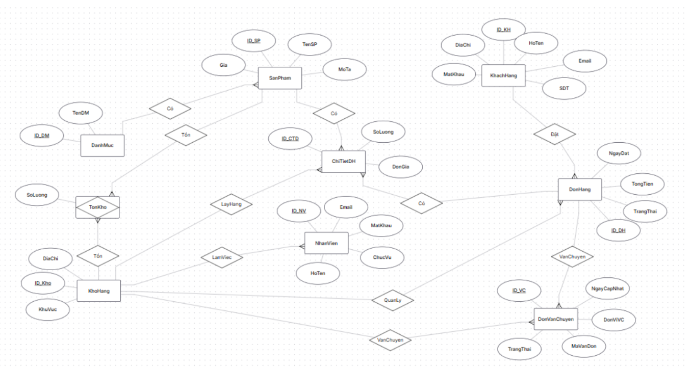

# Thiết kế Cơ sở dữ liệu - Hệ thống Bán hàng Đa Kho
## 1. Sơ đồ Use Case (Tổng quan Nghiệp vụ)
Sơ đồ dưới đây mô tả các tác nhân và chức năng cốt lõi. Điểm nhấn nằm ở module **Xử lý Phân tán** (Điều chuyển hàng, Kiểm tra tồn kho chéo, và Tách đơn hàng).

## 2. Cấu trúc Thực thể & Mối quan hệ (ERD)

Kiến trúc bảng được thiết kế để giải quyết bài toán: **"Khách đặt 1 đơn hàng, nhưng hàng được giao từ nhiều kho khác nhau"**.

**Các mối quan hệ cốt lõi cần nhớ khi code mapping JPA/Hibernate:**
*   **Danh Mục & Sản Phẩm (1-n):** Một danh mục có nhiều sản phẩm, mỗi sản phẩm chỉ thuộc một danh mục.
*   **Sản Phẩm & Tồn Kho (1-n):** Một sản phẩm xuất hiện ở nhiều dòng tồn kho khác nhau (ở các kho khác nhau). Bảng `TonKho` sử dụng khóa chính phức hợp.
*   **Kho Hàng & Tồn Kho (1-n):** Một kho hàng có nhiều dòng tồn kho (của nhiều loại sản phẩm khác nhau).
*   **Khách Hàng & Đơn Hàng (1-n):** Một khách hàng có thể đặt nhiều đơn hàng, 1 đơn hàng chỉ được tạo bởi 1 khách hàng.
*   **Đơn Hàng & Chi Tiết Đơn Hàng (1-n):** Một đơn hàng có nhiều dòng chi tiết đơn hàng (liệt kê các loại sản phẩm trong đơn).
*   **Kho Hàng & Chi Tiết Đơn Hàng (1-n) - QUAN TRỌNG:** Một kho hàng xuất ra nhiều sản phẩm, mỗi sản phẩm được lấy từ một kho. Khóa ngoại `ID_Kho` được đặt ở `ChiTietDH` chứ không nằm ở `DonHang`. Việc này giúp hệ thống biết chính xác từng món đồ trong đơn được xuất từ kho nào.
*   **Sản Phẩm & Chi Tiết Đơn Hàng (1-n):** Một sản phẩm có thể nằm trong nhiều dòng chi tiết đơn hàng (của các đơn hàng khác nhau).
*   **Đơn Hàng & Vận Chuyển (1-n):** Một đơn hàng có thể có nhiều thôngquan vận chuyển (nếu hàng được lấy từ nhiều kho).
*   **Kho Hàng & Vận Chuyển (1-n):** Một kho hàng có thể đưa đi nhiều đơn vận chuyển hàng.
*   **Kho Hàng & Nhân Viên (1-n):** Một kho hàng có nhiều nhân viên làm việc.

## 3. Kiến trúc Phân Tán (Fragmentation & Replication Strategy)

Hệ thống được chia làm 2 cấp: **Máy chủ (Trụ sở chính)** và **Máy trạm (Các kho chi nhánh/Khu vực)**.

### 3.1. Thiết kế lược đồ nhân bản, đồng bộ hóa (Replication)
Thông tin tại máy chủ: **Danh Mục, Sản Phẩm và Khách Hàng** tại máy chủ sẽ được nhân bản tại các máy trạm (đồng bộ hóa về máy trạm mỗi khi có sự thay đổi từ máy chủ).
*   Nhân bản có thể thực thi giữa những CSDL trên cùng một server hay những server khác nhau được kết nối bởi mạng LANs, WANs hay Internet.
*   Thông tin tại máy trạm: `KhoHang`, `NhanVien`, `TonKho`, `DonHang` được cập nhật thì sẽ được đồng bộ hóa về máy chủ mỗi khi có thông tin.

### 3.2. Thiết kế phân mảnh ngang (Horizontal Fragmentation)
Dữ liệu phát sinh hàng ngày tại các kho sẽ được lưu cục bộ tại Máy trạm tương ứng để giảm tải băng thông và tăng tốc độ xử lý. Khi cập nhật sẽ được đẩy về Máy chủ.

*   **Phân mảnh ngang nguyên thủy:**
    *   Bảng gốc: `KhoHang`.
    *   Điều kiện (Ví dụ Kho Hà Đông): $\sigma_{ID="KH01"}(KhoHang)$
*   **Phân mảnh ngang dẫn xuất (Semi-Join):** Các bảng dưới đây sẽ được phân mảnh "ăn theo" mã kho của chúng.
    *   Bảng Nhân Viên: $NhanVien_1 = NhanVien \ltimes KhoHaDong_1$
    *   Bảng Tồn Kho: $TonKho_1 = TonKho \ltimes KhoHaDong_1$
    *   Bảng Chi Tiết Đơn Hàng: $ChiTietDH_1 = ChiTietDH \ltimes KhoHaDong_1$ *(Dòng chi tiết nào xuất từ kho nào sẽ bay về database của kho đó)*.

### 3.3. Cơ chế Truy vấn Phân tán (Tra cứu và Thống kê tồn kho toàn hệ thống)
Vì bảng `TonKho` bị phân mảnh ngang theo từng kho, nên một CSDL cục bộ (Máy trạm) chỉ nắm được số lượng hàng của chính kho đó.

Để giải quyết bài toán **thống kê tổng số lượng còn lại của một sản phẩm trên cả 2 kho** (phục vụ cho việc kiểm tra khả năng đáp ứng trước khi đặt hàng):
*   **Luồng xử lý (Backend):** Tầng Service không thể dùng 1 câu lệnh SQL đơn thuần. Thay vào đó, nó sẽ sử dụng `RoutingDataSource` để mở kết nối và gửi câu lệnh `SELECT SoLuong FROM TonKho WHERE ID_SP = ?` lần lượt đến **tất cả các node** (Kho Miền Bắc, Kho Miền Nam).
*   **Gộp kết quả (Aggregation):** Sau khi nhận kết quả trả về từ các node, code Backend sẽ chịu trách nhiệm cộng gộp (`SUM`) các con số này lại để trả ra tổng tồn kho cuối cùng cho người dùng.

## 4. Lưu ý
*   **Không dùng ID tự tăng (Auto Increment):** Tránh trùng lặp ID khi gom dữ liệu từ nhiều node về. Ưu tiên sử dụng chuỗi ID định danh (VD: `SP01`, `KHO_MB`) hoặc UUID.
*   **Multi-Datasource:** Tầng Service sẽ sử dụng `RoutingDataSource` để switch kết nối giữa các node database trước khi thực thi lệnh query.
